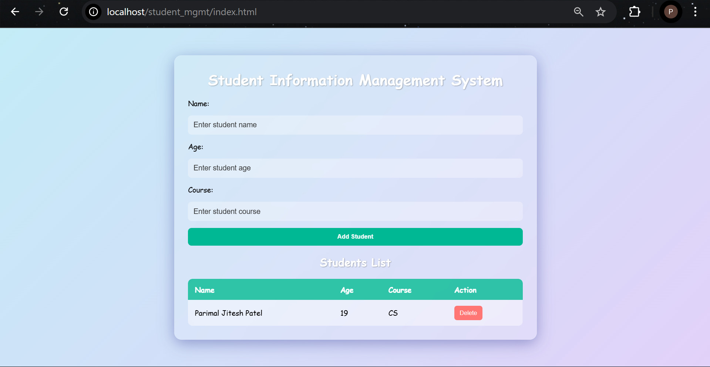

# 🎓 Student Information Management System

A simple, interactive, and beautifully styled Student Information Management System built with **HTML**, **CSS (Glassmorphism + Animations)**, **JavaScript**, **PHP**, and **MySQL**. This project allows you to **add**, **view**, and **delete** student records with real-time UI updates.

---

## 🚀 Features

- Add student details: **Name**, **Age**, **Course**  
- View student list dynamically  
- Delete student entries  
- MySQL database integration  
- Modern Glassmorphism UI with animations and custom scrollbar  
- Fully responsive design  

---

## 🛠️ Technologies Used

- HTML5  
- CSS3 (Glassmorphism + Animations)  
- JavaScript (Fetch API)  
- PHP (MySQLi)  
- MySQL / MariaDB  
- Apache (or any PHP-enabled server)  

---

## 📁 Project Structure

student-management-system/
├── index.html             # Main frontend page to display and manage students
├── styles.css             # Stylesheet for the UI
├── script.js              # JavaScript file to handle AJAX requests
├── config.php             # Database connection configuration
├── add_student.php        # Backend script to add a student to the database
├── fetch_students.php     # Backend script to fetch and return student records
└── delete_student.php     # Backend script to delete a student record


---

## 🧰 Prerequisites

- PHP 7.4 or higher  
- MySQL or MariaDB server  
- Apache or equivalent (XAMPP / WAMP / MAMP recommended)  
- Git (optional, for cloning)

---

## 🔧 Setup & Run Instructions

### 1️⃣ Clone the Repository

```bash
git clone https://github.com/YOUR-USERNAME/student-management-system.git
cd student-management-system
```

### 2️⃣ Create the MySQL Database & Table

1. Open **MySQL Workbench** or your preferred SQL client.  
2. Execute the following SQL:

```sql
CREATE DATABASE IF NOT EXISTS student_mgmt
  CHARACTER SET utf8mb4
  COLLATE utf8mb4_unicode_ci;
USE student_mgmt;

CREATE TABLE IF NOT EXISTS students (
  id INT AUTO_INCREMENT PRIMARY KEY,
  name VARCHAR(100) NOT NULL,
  age INT NOT NULL,
  course VARCHAR(100) NOT NULL,
  created_at TIMESTAMP DEFAULT CURRENT_TIMESTAMP
);
```

## 3️⃣ Configure Database Connection

1. Open `config.php` in your project folder with a text editor.  
2. Replace its contents (or update the existing values) with the following, making sure to set your own MySQL credentials:

```php
<?php
// config.php

$host     = '127.0.0.1';      // or 'localhost'
$username = 'root';           // your MySQL username
$password = '';               // your MySQL password
$database = 'student_mgmt';   // name of the database you created

// Create connection
$conn = new mysqli($host, $username, $password, $database);

// Check connection
if ($conn->connect_error) {
    die('Connection failed: ' . $conn->connect_error);
}

// Always return JSON
header('Content-Type: application/json; charset=utf-8');
```

3. Save the file

## 4️⃣ Serve the Project

1. **Move the project folder** into your web server’s root directory:  
   - **Windows (XAMPP):**  
     ```
     C:\xampp\htdocs\your-project-folder-name\
     ```  
   - **macOS (MAMP):**  
     ```
     /Applications/MAMP/htdocs/your-project-folder-name/
     ```

2. **Start** your web server and database services:  
   - **XAMPP:** Open the XAMPP Control Panel → Start **Apache** and **MySQL**  
   - **MAMP:** Open MAMP → Click **Start Servers**

3. **Open** your browser and go to:  
    http://localhost/student-management-system/index.html

4. The application should load. **Test** by adding a student record to ensure everything is working correctly.  

## 🤝 Contributing

Pull requests are welcome! For major changes, please open an issue first to discuss what you would like to change.


## 📸 Screenshots

<p align="center">
  
</p>
